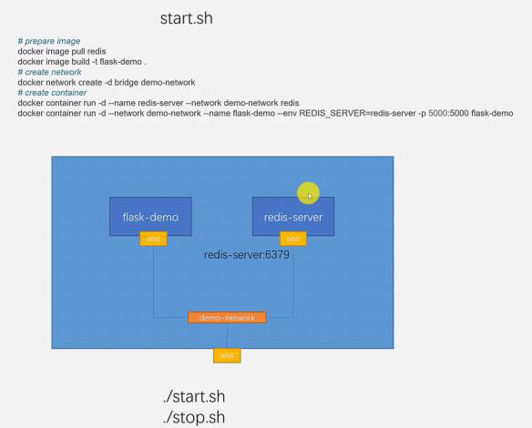
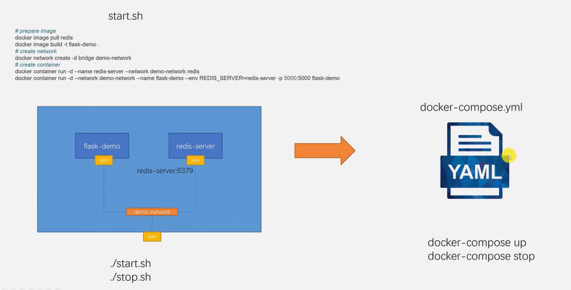

<!-- This md file is originally converted from onenote -->

# [8-1 介紹](https://dockertips.readthedocs.io/en/latest/docker-compose/compose-intro.html)

2023年2月26日
上午 03:51

## Contents [[↑](#8-1-介紹)]

- [8-1 介紹](#8-1-介紹)
  - [Contents \[↑\]](#contents-)
    - [Docker Compose 是什麼 \[↑\]](#docker-compose-是什麼-)
      - [需求背景 \[↑\]](#需求背景-)
      - [Docker Compose \[↑\]](#docker-compose-)
    - [Docker Compose 的組成 \[↑\]](#docker-compose-的組成-)

### Docker Compose 是什麼 [[↑](#8-1-介紹)]

#### 需求背景 [[↑](#8-1-介紹)]

- 在上一章, 通過兩個容器去部署了一個 Python Flask 加上 Redis 的一個應用程序. 在部署這樣的一個應用程序的時候, 實際上有一些固定的步驟:
  - 先去準備所需要的鏡像
  - 然後要去準備一個用戶自定義的網絡
  - 最後就可以去創建容器, 然後把這些容器連到這個網絡上面
- 所以可以把這個固定的套路, 寫成一個腳本 `start.sh`, 需要部署的時候, 運行這個 `start.sh` 就可以了
- 同樣, 如果需要把這個環境給清理掉, 也可以寫一個 `stop.sh` 腳本
  - 把容器給停止
  - 把 containers 刪除
  - 把網絡刪除
  - 最後清理 image
- 有了 `start.sh` 和 `stop.sh` 腳本, 搭建環境或者是清個環境的時候都會方便很多
  <table>
    <colgroup>
      <col style="width: 100%" />
    </colgroup>
    <thead>
      <tr class="header">
        <th>
          

        </th>
      </tr>
    </thead>
    <tbody>
    </tbody>
  </table>

#### Docker Compose [[↑](#8-1-介紹)]

- 基於這樣的一個需求, docker 提供了一個工具, 就是 `docker-compose`
  - `docker-compose` 通過一個 `yaml` 的文件來簡化部署這樣的具有多個容器的應用時的步驟
    <table>
      <colgroup>
        <col style="width: 100%" />
      </colgroup>
      <thead>
        <tr class="header">
          <th>
            

          </th>
        </tr>
      </thead>
      <tbody>
      </tbody>
    </table>

    - 使用 `yaml` 格式的文件定義所需要啟動的容器, 網絡, 端口轉發, 數據存儲 (data volume 或是 bind mount)
    - 這個 `yaml` 文件的預設名稱為 `docker-compose.yml`

  - docker-compose CLI
    - 這個命令行的工具可以基於這樣的一個 `yaml` 文件去啟動或停止環境, e.g.
      - `$ docker compose up`
      - `$ docker compose stop`

### Docker Compose 的組成 [[↑](#8-1-介紹)]

- 這一章會重點講解
  - Docker Compose 特定格式的 `yaml` 文件
  - docker-compose CLI
