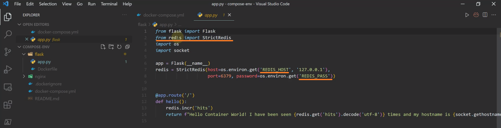
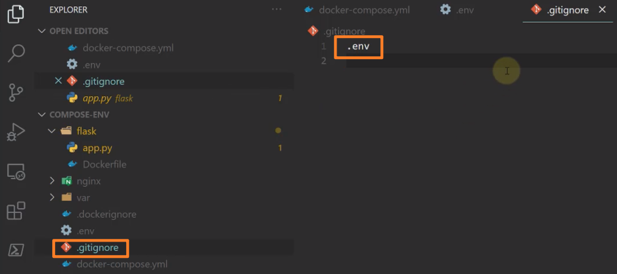
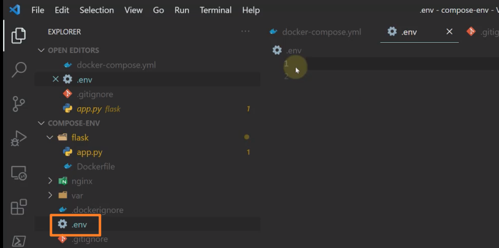
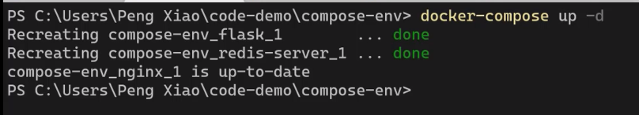
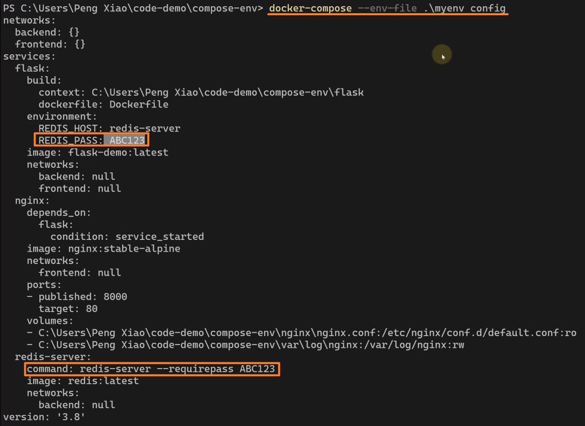

<!-- This md file is originally converted from onenote -->

# [8-10 環境變量](https://dockertips.readthedocs.io/en/latest/docker-compose/compose-env.html)

2024年11月11日
上午 01:23

## Contents [[↑](#8-10-環境變量)]

- [8-10 環境變量](#8-10-環境變量)
  - [Contents \[↑\]](#contents-)
    - [環境搭建 \[↑\]](#環境搭建-)
    - [問題 \[↑\]](#問題-)
      - [將環境變量從外部讀取並注入到 `docker-compose.yml` \[↑\]](#將環境變量從外部讀取並注入到-docker-composeyml-)
      - [自定義環境變量文件 rather than `.env` \[↑\]](#自定義環境變量文件-rather-than-env-)

### 環境搭建 [[↑](#8-10-環境變量)]

- `docker-compose.yml`

  <table>
    <colgroup>
      <col style="width: 100%" />
    </colgroup>
    <thead>
      <tr class="header">
        <th>
          

        </th>
      </tr>
    </thead>
    <tbody>
      <tr class="odd">
        <td>
          

        </td>
      </tr>
    </tbody>
  </table>

  - 為了讓這個程序更加安全一些, 給 `redis-server` 設置了一個密碼
  - 通過 `command` 覆蓋掉原先 `redis` 默認的 `command`. 在這個 `commend` 中加了一個參數叫做 `--requirepass` 並在後面跟上具體要設置的一個密碼
  - 對於 `flask` 的話, 它要去連接 `redis-server`, 所以它需要提供連接 `redis` 的密碼 by `REDIS_PASS` 環境變量, 並在 `flack/app.py` 中讀取和使用這個環境變量

- `$ docker-compose build`

  <table>
    <colgroup>
      <col style="width: 100%" />
    </colgroup>
    <thead>
      <tr class="header">
        <th>
          

        </th>
      </tr>
    </thead>
    <tbody>
    </tbody>
  </table>

- `$ docker-compose up -d`

  <table>
    <colgroup>
      <col style="width: 100%" />
    </colgroup>
    <thead>
      <tr class="header">
        <th>
          

        </th>
      </tr>
    </thead>
    <tbody>
    </tbody>
  </table>

- `$ docker-compose ps`

  <table>
    <colgroup>
      <col style="width: 100%" />
    </colgroup>
    <thead>
      <tr class="header">
        <th>
          

        </th>
      </tr>
    </thead>
    <tbody>
    </tbody>
  </table>

- 效果

  <table>
    <colgroup>
      <col style="width: 100%" />
    </colgroup>
    <thead>
      <tr class="header">
        <th>
          

        </th>
      </tr>
    </thead>
    <tbody>
    </tbody>
  </table>

### 問題 [[↑](#8-10-環境變量)]

- 密碼明文寫在了 `docker-compose.yml` 中, 任何人只要能訪問該 `yml` 文件都可以看到密碼, 相當不安全
  - 雖然 `docker` 提供 `Secret` 這個方法, 但 `Secret` 在 `Compose` 這種單機的模式下是不能使用的. 在 `Docker Compose` 單機的這種模式下是無法使用 `Secret` 的
  - 之後的章節會介紹 `Secret` 的使用方法

- 目標
  - 找一種比較安全的方法存儲這個密碼

#### 將環境變量從外部讀取並注入到 `docker-compose.yml` [[↑](#8-10-環境變量)]

- 在 `docker-compose.yml` 中使用 `${ENV_VAR_NAME}` 來讀取環境變量

  <table>
    <colgroup>
      <col style="width: 100%" />
    </colgroup>
    <thead>
      <tr class="header">
        <th>
          

        </th>
      </tr>
    </thead>
    <tbody>
    </tbody>
  </table>

- 環境變量的設置 - `.env` 文件

  <table>
    <colgroup>
      <col style="width: 100%" />
    </colgroup>
    <thead>
      <tr class="header">
        <th>
          

        </th>
      </tr>
    </thead>
    <tbody>
    </tbody>
  </table>

  - 不要將 `.env` 加入版本管理

    <table>
      <colgroup>
        <col style="width: 100%" />
      </colgroup>
      <thead>
        <tr class="header">
          <th>
            

          </th>
        </tr>
      </thead>
      <tbody>
      </tbody>
    </table>

- `.env` 的配置驗證和預覽
  - `$ docker-compose config`

    <table>
      <colgroup>
        <col style="width: 100%" />
      </colgroup>
      <thead>
        <tr class="header">
          <th>
            

          </th>
        </tr>
      </thead>
      <tbody>
      </tbody>
    </table>

  - 如果沒有設置 `.env`, 則會使用空字符

    <table>
      <colgroup>
        <col style="width: 100%" />
      </colgroup>
      <thead>
        <tr class="header">
          <th>
            

          </th>
        </tr>
      </thead>
      <tbody>
        <tr class="odd">
          <td>
            

          </td>
        </tr>
      </tbody>
    </table>

- `$ docker-compose up -d`

  <table>
    <colgroup>
      <col style="width: 100%" />
    </colgroup>
    <thead>
      <tr class="header">
        <th>
          

        </th>
      </tr>
    </thead>
    <tbody>
      <tr class="odd">
        <td>
          

          <ul class="incremental">
            <li>
              
計數會延續之前的, 因為 redis-server container 並未刪除, 相當於只是重新啟動

            </li>
          </ul>
        </td>
      </tr>
    </tbody>
  </table>

#### 自定義環境變量文件 rather than `.env` [[↑](#8-10-環境變量)]
  
- e.g. `myenv`

  <table>
    <colgroup>
      <col style="width: 100%" />
    </colgroup>
    <thead>
      <tr class="header">
        <th>
          

        </th>
      </tr>
    </thead>
    <tbody>
      <tr class="odd">
        <td>
          

        </td>
      </tr>
    </tbody>
  </table>

- `$ docker-compose` **`--env-file <path_to_env_file> config`**

  <table>
    <colgroup>
      <col style="width: 100%" />
    </colgroup>
    <thead>
      <tr class="header">
        <th>
          

        </th>
      </tr>
    </thead>
    <tbody>
    </tbody>
  </table>

- `$ docker-compose` **`--env-file`** `<path_to_env_file> up -d`

  <table>
    <colgroup>
      <col style="width: 100%" />
    </colgroup>
    <thead>
      <tr class="header">
        <th>
          

        </th>
      </tr>
    </thead>
    <tbody>
    </tbody>
  </table>
