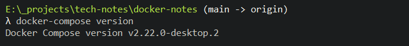
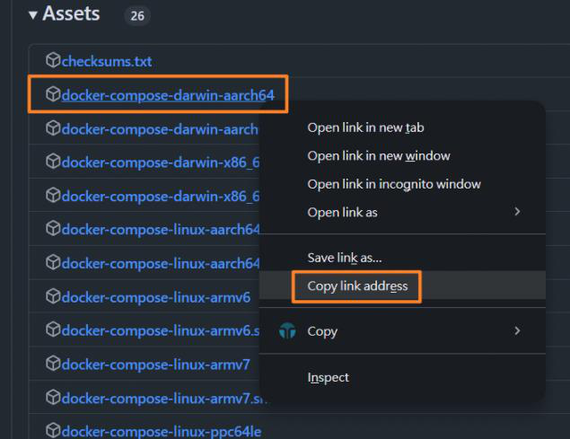

<!-- This md file is originally converted from onenote -->

# [8-2 docker-compose 的安裝](https://dockertips.readthedocs.io/en/latest/docker-compose/compose-install.html)

2024年10月5日
下午 12:12

## Contents [[↑](#8-2-docker-compose-的安裝)]

- [8-2 docker-compose 的安裝](#8-2-docker-compose-的安裝)
  - [Contents \[↑\]](#contents-)
    - [Windows 和 Mac \[↑\]](#windows-和-mac-)
    - [Linux \[↑\]](#linux-)

### Windows 和 Mac [[↑](#8-2-docker-compose-的安裝)]

- 對於 Windows 還有 Mac 的電腦, 如果使用的是 `Docker Desktop`, 那麼安裝完 `Docker Desktop` 以後, `docker-compose` 就自動的安裝了, 不需要額外的再去安裝 `docker-compose`.
  - 可以在命令行中測試系統是否安裝 `docker-compose`: `$` **`docker-compose version`**
    <table>
      <colgroup>
        <col style="width: 100%" />
      </colgroup>
      <thead>
        <tr class="header">
          <th>
            <p></p>
          </th>
        </tr>
      </thead>
      <tbody>
      </tbody>
    </table>

### Linux [[↑](#8-2-docker-compose-的安裝)]

- 如果是 Linux 的話, 則需要自己去安裝
  - 安裝的辦法有主要有兩個

    1. 直接去 [GitHub - Releases · docker/compose](https://github.com/docker/compose/releases) 上面下載一個編譯好的 `docker-compose` 二進制文件

        ```bash
        $ sudo curl -L "https://github.com/docker/compose/releases/download/1.29.2/docker-compose-$(uname -s)-$(uname -m)" -o /usr/local/bin/docker-compose
        $ sudo chmod +x /usr/local/bin/docker-compose
        $ docker-compose --version
        docker-compose version 1.29.2, build 5becea4c
        ```

        - 上面 `$ sudo curl -L "<url>" -o /usr/local/bin/docker-compose` 中的 `<url>` 是從 [GitHub - Releases · docker/compose](https://github.com/docker/compose/releases) 上面找一個想要的版本的 `docker-compose` 的二進制文件的下載地址
          <table>
            <colgroup>
              <col style="width: 100%" />
            </colgroup>
            <thead>
              <tr class="header">
                <th>
                  <p></p>
                  <ul class="incremental">
                    <li>
                      <p>先隨便從 Assets 中選一個按滑鼠右鍵點, 並 "Copy link address", 再從該網址修改成命令所需要的 &lt;url&gt;</p>
                    </li>
                  </ul>
                </th>
              </tr>
            </thead>
            <tbody>
            </tbody>
          </table>

    2. 使用 `pip` 去安裝 `docker-compose`
        - `$` **`pip install docker-compose`**
          - ~~`docker-compose` 實際上是一個使用 Python 編寫的一個工具~~
          - Python 的這些軟件, 都可以通過 `pip` 去安裝
