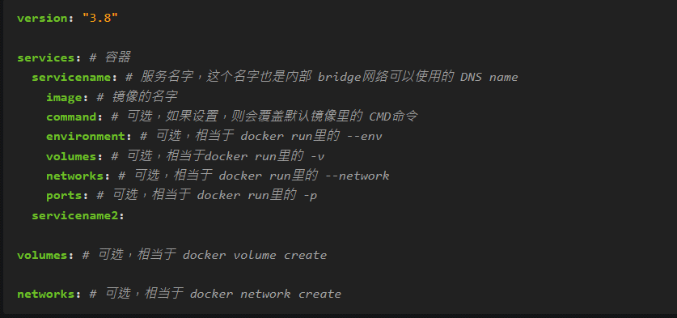
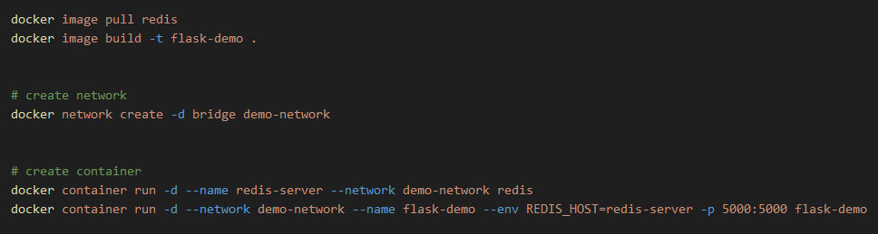
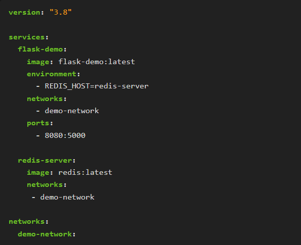

<!-- This md file is originally converted from onenote -->

# [8-3 docker-compose 文件結構和版本](https://dockertips.readthedocs.io/en/latest/docker-compose/compose-file.html)

2024年10月24日
下午 04:23

## Contents [[↑](#8-3-docker-compose-文件結構和版本)]

- [8-3 docker-compose 文件結構和版本](#8-3-docker-compose-文件結構和版本)
  - [Contents \[↑\]](#contents-)
    - [References \[↑\]](#references-)
    - [Docker Compose 文件結構 \[↑\]](#docker-compose-文件結構-)
    - [Docker Compose 文件範例 \[↑\]](#docker-compose-文件範例-)
    - [Docker-Compose 的版本 \[↑\]](#docker-compose-的版本-)

### References [[↑](#8-3-docker-compose-文件結構和版本)]

- [[官方文件] docker compose 的語法說明](https://docs.docker.com/reference/compose-file/)

### Docker Compose 文件結構 [[↑](#8-3-docker-compose-文件結構和版本)]

- 基本語法結構
  <table>
    <colgroup>
      <col style="width: 100%" />
    </colgroup>
    <thead>
      <tr class="header">
        <th>
          

        </th>
      </tr>
    </thead>
    <tbody>
    </tbody>
  </table>

- `docker-compose` 文件是 `YAML` 格式的文件
  - 第一行去定義 `docker-compose` 文件的語法版本

  - **`services`** 這一部分內容是 `compose` 文件的一個核心
    - `services` 實際上是我們所定義的容器
    - `services` 是一個複數, 即可以定義多個容器

      - 定義容器
        - 通過一個名字 `<ServiceName>` 來定義容器
        - 在使用 `Docker Bridge` 網路的時候, 這個 `<ServiceName>` 是可以被這個 `Bridge` 網路中的其他容器 Ping 通的. 也就是說, 這個 `<ServiceName>` 是可以被 DNS 解析的
        - 相當於 `docker run` 創建容器時的 `--name`

      - `image`
        - 所使用的鏡像的名字, 要使用哪個鏡像去創建這個容器

      - `command` (可選)
        - 容器啟動時所執行的命令
          - 若不指定, 則默認去執行 `image` 中定義 `CMD`
          - 若指定, 則會覆蓋 `image` 中定義 `CMD`

      - `environment` (可選)
        - 設置一些環境變量
        - 相當於 `docker run` 創建容器時的 `--env`

      - `volumes` (可選)
        - 相當於 `docker run` 創建容器時的 `-v`
        - `bind mount` 或是 `data volume` 都是可以的

      - `networks` (可選)
        - 指定這個容器到底連哪個網絡
        - 相當於 `docker run` 創建容器時的 `--network`

      - `ports` (可選)
        - 端口轉發
        - 相當於 `docker run` 創建容器時的 `-p`

  - `volumes` (可選)
    - 相當於 `docker volume create` 創建一個 volume

  - `networks` (可選)
    - 相當於 `docker network create` 創建一個網絡

### Docker Compose 文件範例 [[↑](#8-3-docker-compose-文件結構和版本)]

- Python Flask + Redis 練習
  - Shell version
    <table>
      <colgroup>
        <col style="width: 100%" />
      </colgroup>
      <thead>
        <tr class="header">
          <th>
            

          </th>
        </tr>
      </thead>
      <tbody>
      </tbody>
    </table>

  - Docker-compose version
    <table>
      <colgroup>
        <col style="width: 100%" />
      </colgroup>
      <thead>
        <tr class="header">
          <th>
            

          </th>
        </tr>
      </thead>
      <tbody>
      </tbody>
    </table>

### Docker-Compose 的版本 [[↑](#8-3-docker-compose-文件結構和版本)]

- 每一個 Compose 的版本, 對應的 Docker Engine 的 release 有一定的要求
- 目前常用的是 3.x 的版本, 所以初學者直接使用 3.x 即可
- 對於常用的內容, 其實從 版本2 到 版本3 沒有很大的變化
