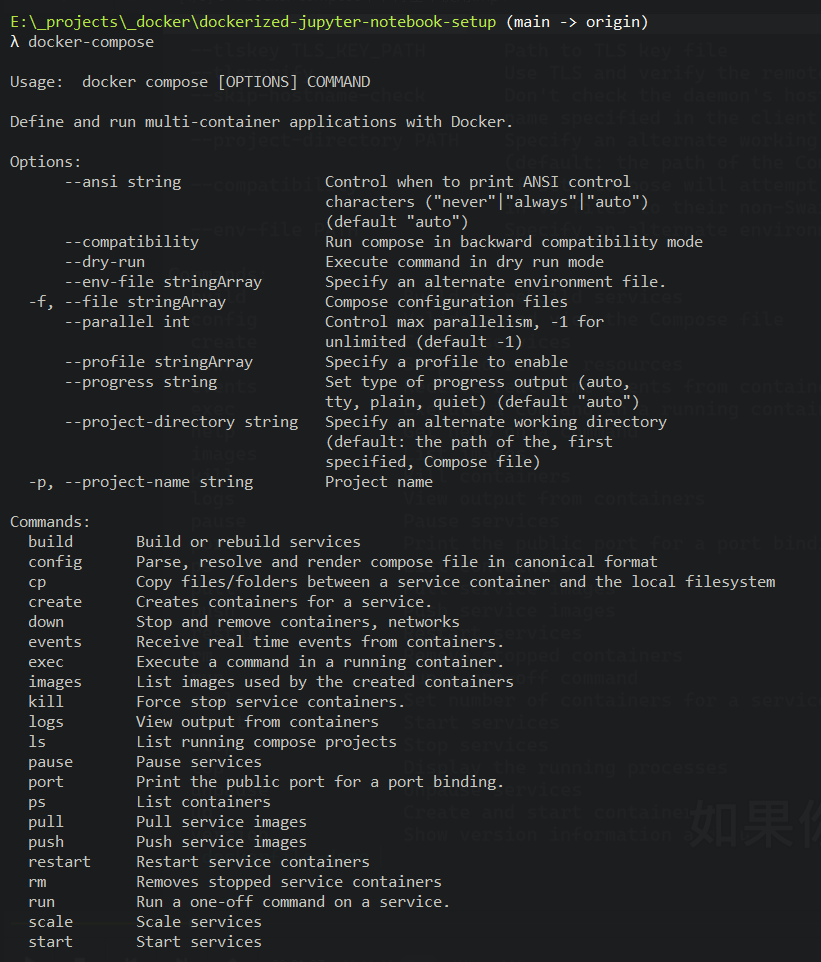
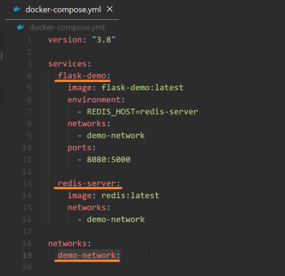
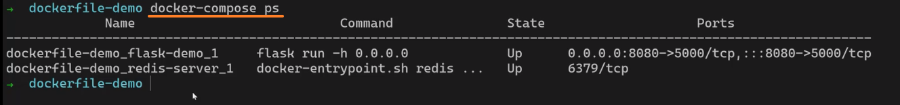
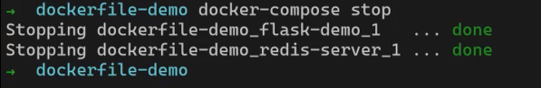
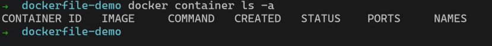
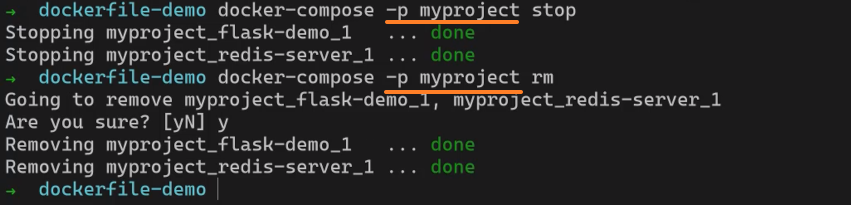
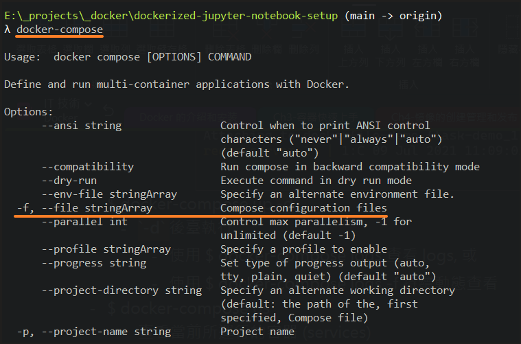
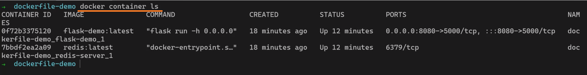
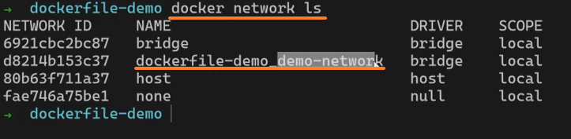

<!-- This md file is originally converted from onenote -->

# 8-4 docker-compose 命令行基本使用

2024年10月24日
下午 11:53

## Contents [[↑](#8-4-docker-compose-命令行基本使用)]

- [8-4 docker-compose 命令行基本使用](#8-4-docker-compose-命令行基本使用)
  - [Contents \[↑\]](#contents-)
    - [docker-compose 命令行 \[↑\]](#docker-compose-命令行-)
      - [`$ docker-compose` \[↑\]](#-docker-compose-)
      - [`$ docker-compose up` \[↑\]](#-docker-compose-up-)
      - [`$ docker-compose ps` \[↑\]](#-docker-compose-ps-)
      - [`$ docker-compose stop` \[↑\]](#-docker-compose-stop-)
      - [`$ docker-compose rm` \[↑\]](#-docker-compose-rm-)
    - [更改 project name \[↑\]](#更改-project-name-)
    - [更改顯示的容器名 \[↑\]](#更改顯示的容器名-)
    - [注意事項 \[↑\]](#注意事項-)

### docker-compose 命令行 [[↑](#8-4-docker-compose-命令行基本使用)]

#### `$ docker-compose` [[↑](#8-4-docker-compose-命令行基本使用)]

- `$ docker-compose` 查看支持的命令
  <table>
    <colgroup>
      <col style="width: 100%" />
    </colgroup>
    <thead>
      <tr class="header">
        <th>
          

        </th>
      </tr>
    </thead>
    <tbody>
    </tbody>
  </table>

#### `$ docker-compose up` [[↑](#8-4-docker-compose-命令行基本使用)]

- `$ docker-compose up` 來 Create and start containers
  <table>
    <colgroup>
      <col style="width: 100%" />
    </colgroup>
    <thead>
      <tr class="header">
        <th>
          

          <blockquote>
          </blockquote>
        </th>
      </tr>
    </thead>
    <tbody>
    </tbody>
  </table>

  - 前台運行, logs 會輸出到前台
    - 前台運行不能停止, 一旦停止, containers 就退出了

  - 命名規則 (可更改)
    <table>
      <colgroup>
        <col style="width: 100%" />
      </colgroup>
      <thead>
        <tr class="header">
          <th>
            

            <blockquote>
            </blockquote>
          </th>
        </tr>
      </thead>
      <tbody>
      </tbody>
    </table>

    - 預設 container 名字為 `<文件夾名>_<ServiceName>_<數字>`
    - 預設的 network 名字為 `<文件夾名>_<NetworkName>`
      <table>
        <colgroup>
          <col style="width: 100%" />
        </colgroup>
        <thead>
          <tr class="header">
            <th>
              

            </th>
          </tr>
        </thead>
        <tbody>
        </tbody>
      </table>

  - `$ docker-compose up **-d**`
    - **`-d`** 後台執行
      - 使用 `$ docker-compose logs` 查看 logs, 或
      - 使用 `$ docker-compose logs -f` 持續動態查看

#### `$ docker-compose ps` [[↑](#8-4-docker-compose-命令行基本使用)]

- 查看當前所運行的容器 (services)
  <table>
    <colgroup>
      <col style="width: 100%" />
    </colgroup>
    <thead>
      <tr class="header">
        <th>
          

        </th>
      </tr>
    </thead>
    <tbody>
    </tbody>
  </table>

#### `$ docker-compose stop` [[↑](#8-4-docker-compose-命令行基本使用)]

- 把當前 compose 文件啟動的 services 或者是 containers 停掉
  <table>
    <colgroup>
      <col style="width: 100%" />
    </colgroup>
    <thead>
      <tr class="header">
        <th>
          

        </th>
      </tr>
    </thead>
    <tbody>
      <tr class="odd">
        <td>
          

        </td>
      </tr>
    </tbody>
  </table>

#### `$ docker-compose rm` [[↑](#8-4-docker-compose-命令行基本使用)]

- 刪除後台已經停止的這些通過當前 compose 文件所創建的 containers
- 但 `docker-compose rm` 並不會刪除 compose 文件所創建的 network
  <table>
    <colgroup>
      <col style="width: 100%" />
    </colgroup>
    <thead>
      <tr class="header">
        <th>
          

        </th>
      </tr>
    </thead>
    <tbody>
      <tr class="odd">
        <td>
          

        </td>
      </tr>
      <tr class="even">
        <td>
          

        </td>
      </tr>
    </tbody>
  </table>

- 要另外執行以下命令來刪除 `network`
  - `$ docker network rm` 或是
  - `$ docker system prune -f` 去清理沒有使用的網絡或容器
    - [3-5 命令行小技巧之批量操作](../3-quick-start/3-5-bulk-commands-for-containers.md#清理刪除停止的容器不用的-image-network-or-volume-)

### 更改 project name [[↑](#8-4-docker-compose-命令行基本使用)]

- `docker-compose` 預設使用 `<文件夾名>` 作為 `project name`
- 而這個 `project name` 預設會作為容器名的前綴
- 可以使用 `-p` 來指定 `project name`
  <table>
    <colgroup>
      <col style="width: 100%" />
    </colgroup>
    <thead>
      <tr class="header">
        <th>
          

        </th>
      </tr>
    </thead>
    <tbody>
    </tbody>
  </table>

  - 這樣做的缺點是, 此後每次使用 docker-compose 命令都要帶上這個 \`-p\` 參數. 否則, 命令會找不到 config file
    <table>
      <colgroup>
        <col style="width: 100%" />
      </colgroup>
      <thead>
        <tr class="header">
          <th>
            

          </th>
        </tr>
      </thead>
      <tbody>
        <tr class="odd">
          <td>
            

          </td>
        </tr>
        <tr class="even">
          <td>
            

          </td>
        </tr>
      </tbody>
    </table>

### 更改顯示的容器名 [[↑](#8-4-docker-compose-命令行基本使用)]

- 顯示的容器名預設為 `<project_name>_<service_name>_<number>`
  - `<number>` 是用於 scale 的
- 自定義容器名
  - Compose 文件中的 service 定義一個 `container_name` 屬性
    <table>
      <colgroup>
        <col style="width: 100%" />
      </colgroup>
      <thead>
        <tr class="header">
          <th>
            

          </th>
        </tr>
      </thead>
      <tbody>
        <tr class="odd">
          <td>
            

            <ul class="incremental">
              <li>
                
手動指定 container 的名字的話, 它會把 &lt;project_name&gt; 前綴刪掉, 也會把 &lt;number&gt; 後綴刪掉

              </li>
              <li>
                
這樣在做 scale 時會受到影響

              </li>
            </ul>
          </td>
        </tr>
      </tbody>
    </table>

### 注意事項 [[↑](#8-4-docker-compose-命令行基本使用)]

- 當要去運行 `docker-compose` 命令的時候, 一定要在有 Compose 文件所在的目錄去運行. 否則, 它找不到 Compose 文件, 就會有一個錯誤的輸出
  <table>
    <colgroup>
      <col style="width: 100%" />
    </colgroup>
    <thead>
      <tr class="header">
        <th>
          

        </th>
      </tr>
    </thead>
    <tbody>
    </tbody>
  </table>

- Compose 文件的文件名預設是 `docker-compose.yml`, 如果用別的名字的話, 需要用 `-f` 來指定路徑和檔名. 這類似於 `docker image build -f` 來指定 `Dockerfile` 的路徑和檔名
  - [4-7 鏡像的構建和分享](../4-image/4-7-build-and-share-images.md#注意事項-)
    <table>
      <colgroup>
        <col style="width: 100%" />
      </colgroup>
      <thead>
        <tr class="header">
          <th>
            

          </th>
        </tr>
      </thead>
      <tbody>
        <tr class="odd">
          <td>
            

          </td>
        </tr>
      </tbody>
    </table>

- 使用 `docker-compose` 所創建的資源也可以使用 `docker` 命令來查看
  <table>
    <colgroup>
      <col style="width: 100%" />
    </colgroup>
    <thead>
      <tr class="header">
        <th>
          

        </th>
      </tr>
    </thead>
    <tbody>
      <tr class="odd">
        <td>
          

        </td>
      </tr>
    </tbody>
  </table>
