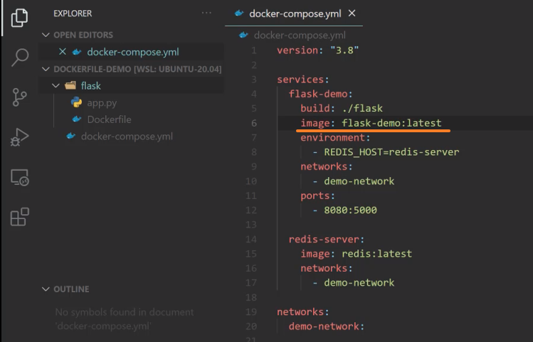
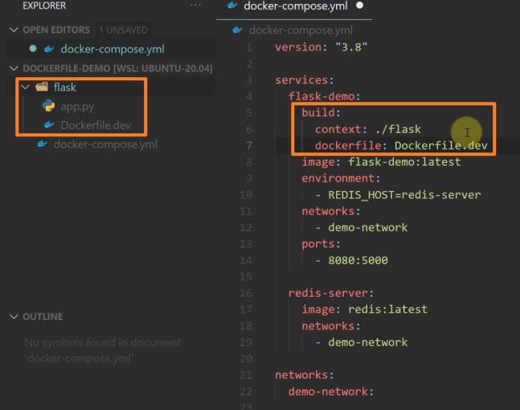

<!-- This md file is originally converted from onenote -->

# 8-5 docker-compose 鏡像構建和拉取

2024年10月27日
下午 09:24

## Contents [[↑](#8-5-docker-compose-鏡像構建和拉取)]

- [8-5 docker-compose 鏡像構建和拉取](#8-5-docker-compose-鏡像構建和拉取)
  - [Contents \[↑\]](#contents-)
    - [docker-compose 主動拉取鏡像 \[↑\]](#docker-compose-主動拉取鏡像-)
    - [docker-compose 鏡像構建 \[↑\]](#docker-compose-鏡像構建-)
    - [docker-compose 手動拉取鏡像 \[↑\]](#docker-compose-手動拉取鏡像-)

### docker-compose 主動拉取鏡像 [[↑](#8-5-docker-compose-鏡像構建和拉取)]

- 在 compose 文件中使用 `image` 指定鏡像的名字, 假如本地沒有鏡像的話, `$ docker-compose up` 就會主動去 docker hub 上拉取鏡像
  <table>
    <colgroup>
      <col style="width: 100%" />
    </colgroup>
    <thead>
      <tr class="header">
        <th>
          

        </th>
      </tr>
    </thead>
    <tbody>
      <tr class="odd">
        <td>
          

          <blockquote>
          </blockquote>
        </td>
      </tr>
    </tbody>
  </table>

### docker-compose 鏡像構建 [[↑](#8-5-docker-compose-鏡像構建和拉取)]

- 在 compose 文件中使用 `build` 指定鏡像的 build context 以及 Dockerfile
  <table>
    <colgroup>
      <col style="width: 100%" />
    </colgroup>
    <thead>
      <tr class="header">
        <th>
          

          <blockquote>
            
 

          </blockquote>
        </th>
      </tr>
    </thead>
    <tbody>
    </tbody>
  </table>

- `$ docker-compose build` 進行鏡像構建
  <table>
    <colgroup>
      <col style="width: 100%" />
    </colgroup>
    <thead>
      <tr class="header">
        <th>
          

        </th>
      </tr>
    </thead>
    <tbody>
      <tr class="odd">
        <td>
          

          <blockquote>
          </blockquote>
        </td>
      </tr>
    </tbody>
  </table>

  - 所創建的 image 是以 `<project_name>_<service_name>` 來命名
  - 如果想換名字, 使用 `image` 指定鏡像的名字
    <table>
      <colgroup>
        <col style="width: 100%" />
      </colgroup>
      <thead>
        <tr class="header">
          <th>
            

          </th>
        </tr>
      </thead>
      <tbody>
        <tr class="odd">
          <td>
            

          </td>
        </tr>
        <tr class="even">
          <td>
            

          </td>
        </tr>
      </tbody>
    </table>

- compose 文件中 `build` 的詳細參數
  - 在 compose 文件中, `build` 默認是在 build context 中找名為 `Dockerfile` 的文件
    <table>
      <colgroup>
        <col style="width: 100%" />
      </colgroup>
      <thead>
        <tr class="header">
          <th>
            

          </th>
        </tr>
      </thead>
      <tbody>
      </tbody>
    </table>

  - 如果 build context 中沒有 `Dockerfile` 這個檔案名, 則會報錯
    <table>
      <colgroup>
        <col style="width: 100%" />
      </colgroup>
      <thead>
        <tr class="header">
          <th>
            

          </th>
        </tr>
      </thead>
      <tbody>
      </tbody>
    </table>

  - 在 compose 文件中使用 `dockerfile` 指定使用的 dockerfile
    <table>
      <colgroup>
        <col style="width: 100%" />
      </colgroup>
      <thead>
        <tr class="header">
          <th>
            

          </th>
        </tr>
      </thead>
      <tbody>
        <tr class="odd">
          <td>
            

          </td>
        </tr>
      </tbody>
    </table>

  - 基本上 `$ docker image build --help` 能使用的參數, `$ docker-compose build` 中也都有對應的參數可以在 compose 文件中指定

### docker-compose 手動拉取鏡像 [[↑](#8-5-docker-compose-鏡像構建和拉取)]

- `$ docker-compose pull`
  <table>
    <colgroup>
      <col style="width: 100%" />
    </colgroup>
    <thead>
      <tr class="header">
        <th>
          

        </th>
      </tr>
    </thead>
    <tbody>
    </tbody>
  </table>

- `$ docker-compose pull` 是在啟動服務前先將鏡像準備好, 這個準備的過程, 可能是構建鏡像, 也可以是拉取鏡像, e.g.
  - `$ docker-compose pull` 時, 構建了 `flask-demo` 所需的鏡像
  - `$ docker-compose pull` 時, 拉取了 `redis-server` 所需的鏡像
- `$ docker-compose up` 也會自動拉取鏡像, 但是不會構建鏡像
