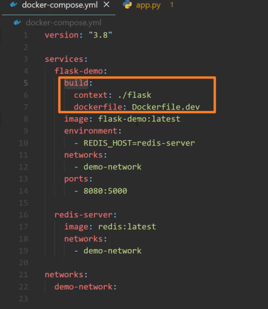
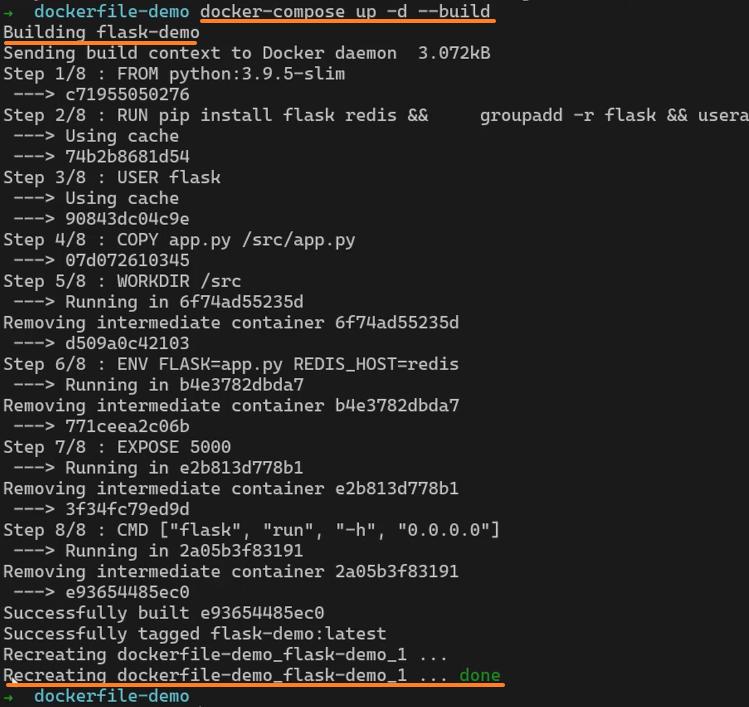
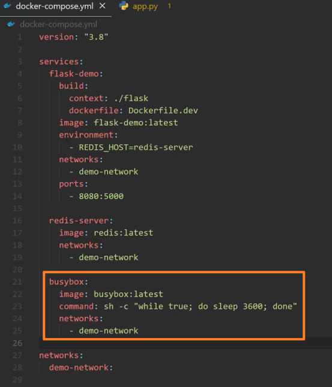
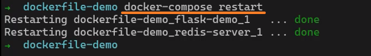

<!-- This md file is originally converted from onenote -->

# 8-6 docker-compose 服務更新

2024年10月27日
下午 10:28

## Contents [[↑](#8-6-docker-compose-服務更新)]

- [8-6 docker-compose 服務更新](#8-6-docker-compose-服務更新)
  - [Contents \[↑\]](#contents-)
    - [環境準備](#環境準備)
    - [更新狀況1 - source code 更新](#更新狀況1---source-code-更新)
    - [更新狀況2 - 新增服務](#更新狀況2---新增服務)
    - [更新狀況3 - 刪除服務](#更新狀況3---刪除服務)
    - [更新狀況4 - 服務重啟](#更新狀況4---服務重啟)
    - [總結](#總結)

### 環境準備

- Dockerfile & compose file
  <table>
    <colgroup>
      <col style="width: 100%" />
    </colgroup>
    <thead>
      <tr class="header">
        <th>
          

        </th>
      </tr>
    </thead>
    <tbody>
    </tbody>
  </table>

- 運行狀況
  <table>
    <colgroup>
      <col style="width: 100%" />
    </colgroup>
    <thead>
      <tr class="header">
        <th>
          

        </th>
      </tr>
    </thead>
    <tbody>
    </tbody>
  </table>

### 更新狀況1 - source code 更新

- `flask/app.py` 有更新
  - 如果使用 `docker` 命令 `$ docker image build`, `docker` 會發現這個文件發生了改變, `docker` 會重新去構建這個鏡像
  - 對於 `docker-compose` 來說, 如果只是簡單使用 `$ docker-compose up`, `docker-compose` 並不會重新去構建這個鏡像

    <table>
      <colgroup>
        <col style="width: 100%" />
      </colgroup>
      <thead>
        <tr class="header">
          <th>
            

          </th>
        </tr>
      </thead>
      <tbody>
      </tbody>
    </table>

- 觸發 `docker-compose` 構建新鏡像的方法

1. `$ docker-compose build`

   - 構建 `yml` file 中所有有定義 `build` 的 `services` 的 images

      <table>
        <colgroup>
          <col style="width: 100%" />
        </colgroup>
        <thead>
          <tr class="header">
            <th>
              

            </th>
          </tr>
        </thead>
        <tbody>
        </tbody>
      </table>

2. `$ docker-compose` **`build <service_name>`**`
   - `$ docker-compose build flask-demo`
   - 指定構建 `yml` file 中有定義 `build` 的 `service` 的 image

3. `$ docker-compose up -d` **`--build`**
   - 這個命令即使在 `services up` 的狀態下也可以使用
   - 這個命令比較智能的地方是他只會重新創建需要的 image 並重啟該服務

      <table>
        <colgroup>
          <col style="width: 100%" />
        </colgroup>
        <thead>
          <tr class="header">
            <th>
              

            </th>
          </tr>
        </thead>
        <tbody>
          <tr class="odd">
            <td>
              

              <ul class="incremental">
                <li>
                  
`redis-server` 並沒有重啟

                </li>
              </ul>
            </td>
          </tr>
          <tr class="even">
            <td>
              

              <ul class="incremental">
                <li>
                  
兩個 services 都已經是最新的了, 不需要重新構建, 也不需要重啟

                </li>
              </ul>
            </td>
          </tr>
        </tbody>
      </table>

### 更新狀況2 - 新增服務

- 在 `yml` file 中添加一個新的 `service`

  <table>
    <colgroup>
      <col style="width: 100%" />
    </colgroup>
    <thead>
      <tr class="header">
        <th>
          

        </th>
      </tr>
    </thead>
    <tbody>
    </tbody>
  </table>

- `$ docker-compose up -d`

  <table>
    <colgroup>
      <col style="width: 100%" />
    </colgroup>
    <thead>
      <tr class="header">
        <th>
          

          <ul class="incremental">
            <li>
              
不需要更新的服務保持不變

            </li>
            <li>
              
同時, 起一個新的 busybox 服務

            </li>
          </ul>
        </th>
      </tr>
    </thead>
    <tbody>
      <tr class="odd">
        <td>
          

          <ul class="incremental">
            <li>
              
在啟動新服務的同時, `docker-compose` 會視需要拉取或構建所需的 image

            </li>
          </ul>
        </td>
      </tr>
      <tr class="even">
        <td>
          

        </td>
      </tr>
    </tbody>
  </table>

### 更新狀況3 - 刪除服務

- 在 `yml` file 中刪除一個 `service`

  <table>
    <colgroup>
      <col style="width: 100%" />
    </colgroup>
    <thead>
      <tr class="header">
        <th>
          

        </th>
      </tr>
    </thead>
    <tbody>
    </tbody>
  </table>

- `$ docker-compose up`

  <table>
    <colgroup>
      <col style="width: 100%" />
    </colgroup>
    <thead>
      <tr class="header">
        <th>
          

          <ul class="incremental">
            <li>
              
不需要更新的服務保持不變

            </li>
            <li>
              
同時, 發出一個發現有一個被遺棄的 container (dockerfile-demo_busybox_1) 的警告

            </li>
          </ul>
        </th>
      </tr>
    </thead>
    <tbody>
    </tbody>
  </table>

- `$ docker-compose up -d` **`--remove-orphans`**

  <table>
    <colgroup>
      <col style="width: 100%" />
    </colgroup>
    <thead>
      <tr class="header">
        <th>
          

        </th>
      </tr>
    </thead>
    <tbody>
    </tbody>
  </table>

### 更新狀況4 - 服務重啟

- 如果 `yml` file 中在啟動服務時, 需要去加載一個本地的配置文件 e.g. 使用 `volume`, 而這個配置文件修改了, 為了讓它生效, 就必須重啟服務
- `$ docker-compose` **`restart`**

  <table>
    <colgroup>
      <col style="width: 100%" />
    </colgroup>
    <thead>
      <tr class="header">
        <th>
          

          <ul class="incremental">
            <li>
              
就真的只是簡單的重啟而已, 並不會去重新創建 images

            </li>
          </ul>
        </th>
      </tr>
    </thead>
    <tbody>
    </tbody>
  </table>

### 總結

- 常用來更新服務的操作
  - `$ docker-compose up -d` **`--build`**
  - `$ docker-compose up -d` **`--remove-orphans`**
  - `$ docker-compose` **`restart`**

- 可以將其簡化成一個命令
  - `$ docker-compose` **`-d --build --remove-orphans &&`** `docker-compose` **`restart`**
  - `&&` 確保上一步成功後才會執行 `restart`
