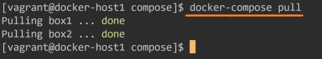
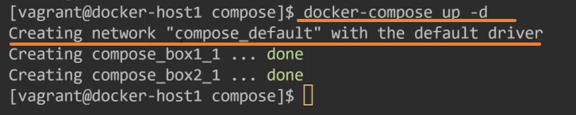
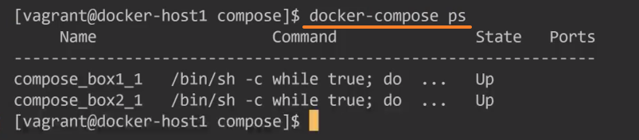
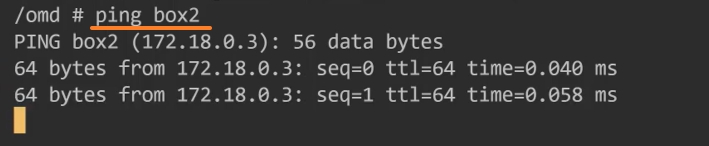
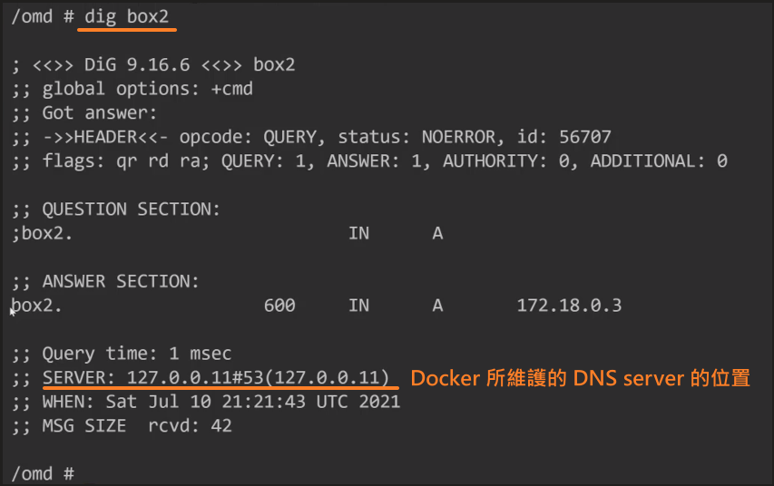
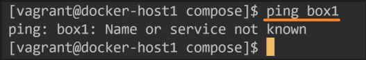

<!-- This md file is originally converted from onenote -->

# 8-7 docker-compose 網絡 - 1

2024年11月4日
上午 08:09

## Contents [[↑](#8-7-docker-compose-網絡---1)]

- [8-7 docker-compose 網絡 - 1](#8-7-docker-compose-網絡---1)
  - [Contents \[↑\]](#contents-)
    - [環境搭建 \[↑\]](#環境搭建-)
  - [默認 `network` \[↑\]](#默認-network-)
    - [Ping `<container_name>` \[↑\]](#ping-container_name-)
    - [Ping `<service_name>` \[↑\]](#ping-service_name-)
    - [Behind the scene \[↑\]](#behind-the-scene-)

### 環境搭建 [[↑](#8-7-docker-compose-網絡---1)]

- 一台沒有任何鏡像的 Linux 虛擬機

  <table>
    <colgroup>
      <col style="width: 100%" />
    </colgroup>
    <thead>
      <tr class="header">
        <th>
          

        </th>
      </tr>
    </thead>
    <tbody>
    </tbody>
  </table>

- 先拉取鏡像: `$ docker-compose pull`

  <table>
    <colgroup>
      <col style="width: 100%" />
    </colgroup>
    <thead>
      <tr class="header">
        <th>
          

        </th>
      </tr>
    </thead>
    <tbody>
    </tbody>
  </table>

- Compose yml file

  <table>
    <colgroup>
      <col style="width: 100%" />
    </colgroup>
    <thead>
      <tr class="header">
        <th>
          

        </th>
      </tr>
    </thead>
    <tbody>
    </tbody>
  </table>

  - 定義了兩個 services: `box1` 和 `box2`
    - 這個 image 的 [Dockerfile](https://github.com/oh-my-docker/net-box/blob/master/Dockerfile), 裡面安裝了一些常用的網絡的相關的工具

  - 沒有指定任何相關和網絡相關的內容
    - 沒有通過 `network` 創建網絡
    - 也沒有去指定 `box1` 和 `box2` 具體要連接哪個網絡

## 默認 `network` [[↑](#8-7-docker-compose-網絡---1)]

- `$ docker-compose up -d` 雖然沒有去指定任何和網絡相關的配置, 他也會幫去默認創建一個名字為 `<project_name>_default` 的 Bridge 網絡

  <table>
    <colgroup>
      <col style="width: 100%" />
    </colgroup>
    <thead>
      <tr class="header">
        <th>
          

        </th>
      </tr>
    </thead>
    <tbody>
      <tr class="odd">
        <td>
          

        </td>
      </tr>
    </tbody>
  </table>

  - `$ docker-compose inspect compose_default`

    <table>
      <colgroup>
        <col style="width: 100%" />
      </colgroup>
      <thead>
        <tr class="header">
          <th>
            

          </th>
        </tr>
      </thead>
      <tbody>
      </tbody>
    </table>

### Ping `<container_name>` [[↑](#8-7-docker-compose-網絡---1)]

- 如果多個容器連接到的是一個用戶自定義的 Bridge 網絡, 容器間的名字就可以 ping 通
  - [7-9 創建和使用自定義 bridge (下)](onenote:Ch7-Docker%20的網絡.one#7-9%20創建和使用自定義%20bridge%20(下)&section-id={9133605D-EF20-47B1-AED0-9FBCA7F58CC9}&page-id={B528A059-4EA6-4440-B475-4A0981CD2E25}&end&base-path=https://d.docs.live.net/A0B8C23463A6F9B5/文件/IT%20技術/DevOps/Docker%5eJ%20K8S/Docker容器技術從入門到精通/Docker)

    <table>
      <colgroup>
        <col style="width: 100%" />
      </colgroup>
      <thead>
        <tr class="header">
          <th>
            

          </th>
        </tr>
      </thead>
      <tbody>
        <tr class="odd">
          <td>
            

          </td>
        </tr>
      </tbody>
    </table>

### Ping `<service_name>` [[↑](#8-7-docker-compose-網絡---1)]

- 如果是使用 `docker-compose` 創建的 services, 在容器內部還可以 ping `<service_name>`

  <table>
    <colgroup>
      <col style="width: 100%" />
    </colgroup>
    <thead>
      <tr class="header">
        <th>
          

        </th>
      </tr>
    </thead>
    <tbody>
      <tr class="odd">
        <td>
          

        </td>
      </tr>
    </tbody>
  </table>

### Behind the scene [[↑](#8-7-docker-compose-網絡---1)]

- Docker Engine 會在後台維護一個 DNS server
  - docker 本身會把 `<container_name>` 寫入到 Docker Engine 的 DNS server
  - docker-compose 則會把 `<service_name>` 寫入到 Docker Engine 的 DNS server

    <table>
      <colgroup>
        <col style="width: 100%" />
      </colgroup>
      <thead>
        <tr class="header">
          <th>
            

          </th>
        </tr>
      </thead>
      <tbody>
        <tr class="odd">
          <td>
            

            <ul class="incremental">
              <li>
                
Docker 所維護的 DNS

              </li>
            </ul>
          </td>
        </tr>
      </tbody>
    </table>

- 注意
  - 主機雖然可以 ping 通 Docker 所維護的 DNS, 但主機上有自己的 DNS. 所以主機並不會使用 Docker 的 DNS, 因此主機是 ping 不通 box1 的

    <table>
      <colgroup>
        <col style="width: 100%" />
      </colgroup>
      <thead>
        <tr class="header">
          <th>
            

          </th>
        </tr>
      </thead>
      <tbody>
        <tr class="odd">
          <td>
            

            <ul class="incremental">
              <li>
                
主機自己的 DNS 的位置

              </li>
            </ul>
          </td>
        </tr>
        <tr class="even">
          <td>
            

          </td>
        </tr>
      </tbody>
    </table>

- 容器內部優先使用 Docker 的 DNS, 若在 Docker 的 DNS 中找不到, 則向上使用主機的 DNS 進行查找

  <table>
    <colgroup>
      <col style="width: 100%" />
    </colgroup>
    <thead>
      <tr class="header">
        <th>
          

          <ul class="incremental">
            <li>
              
容器內部優先使用 Docker 的 DNS

            </li>
          </ul>
        </th>
      </tr>
    </thead>
    <tbody>
      <tr class="odd">
        <td>
          

          <ul class="incremental">
            <li>
              
若在 Docker 的 DNS 中找不到, 則向上使用主機的 DNS 進行查找

            </li>
          </ul>
        </td>
      </tr>
    </tbody>
  </table>
