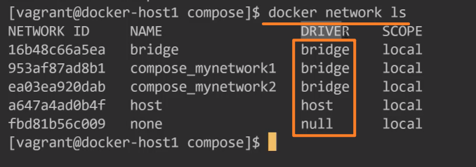
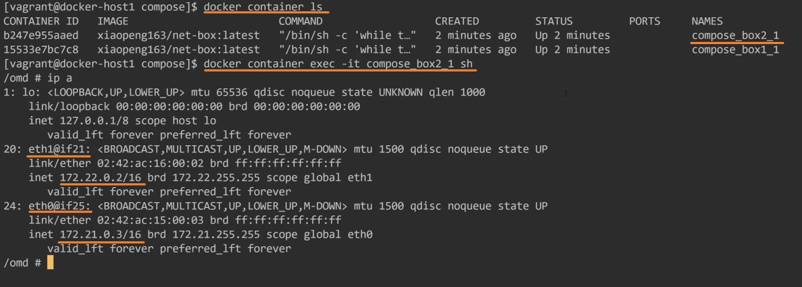
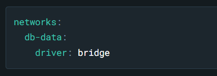

<!-- This md file is originally converted from onenote -->

# 8-8 docker-compose 網絡 - 2

2024年11月7日
上午 11:57

## Contents [[↑](#8-8-docker-compose-網絡---2)]

- [8-8 docker-compose 網絡 - 2](#8-8-docker-compose-網絡---2)
  - [Contents \[↑\]](#contents-)
    - [環境搭建 \[↑\]](#環境搭建-)
    - [連接情況 \[↑\]](#連接情況-)
    - [`docker-compose` 的 `network` 配置 \[↑\]](#docker-compose-的-network-配置-)

### 環境搭建 [[↑](#8-8-docker-compose-網絡---2)]

- `docker-compose.yml`

  <table>
    <colgroup>
      <col style="width: 100%" />
    </colgroup>
    <thead>
      <tr class="header">
        <th>
          

        </th>
      </tr>
    </thead>
    <tbody>
    </tbody>
  </table>

- `$ docker-compose up -d`

  <table>
    <colgroup>
      <col style="width: 100%" />
    </colgroup>
    <thead>
      <tr class="header">
        <th>
          

        </th>
      </tr>
    </thead>
    <tbody>
    </tbody>
  </table>

  - 什麼是 `default driver`

    - `Driver` 的種類

      <table>
        <colgroup>
          <col style="width: 100%" />
        </colgroup>
        <thead>
          <tr class="header">
            <th>
              

            </th>
          </tr>
        </thead>
        <tbody>
        </tbody>
      </table>

  - 對於 compose 選用的 `default driver` 是根據使用 compose 的環境來決定的
    - 單機環境下使用 compose, `default driver` 就是 `bridge`
    - 如果是多機環境下使用 swarm, `default driver` 就不是 `bridge`, 是 `overlay`, 後面 swarm 時再去看 `overlay` 具體是什麼

### 連接情況 [[↑](#8-8-docker-compose-網絡---2)]

- `$ docker inspect compose_network1`

  <table>
    <colgroup>
      <col style="width: 100%" />
    </colgroup>
    <thead>
      <tr class="header">
        <th>
          

          <ul class="incremental">
            <li>
              
box1 和 box2 都連上了 network1

            </li>
          </ul>
        </th>
      </tr>
    </thead>
    <tbody>
    </tbody>
  </table>

- `$ docker inspect compose_network2`

  <table>
    <colgroup>
      <col style="width: 100%" />
    </colgroup>
    <thead>
      <tr class="header">
        <th>
          

          <ul class="incremental">
            <li>
              
box2 還連上了 network2

            </li>
          </ul>
        </th>
      </tr>
    </thead>
    <tbody>
    </tbody>
  </table>

- `$ docker container exec -it compose_box2_1 sh`

  <table>
    <colgroup>
      <col style="width: 100%" />
    </colgroup>
    <thead>
      <tr class="header">
        <th>
          

          <ul class="incremental">
            <li>
              
box2 連上了兩個 networks

            </li>
          </ul>
        </th>
      </tr>
    </thead>
    <tbody>
    </tbody>
  </table>

- `$ docker container exec -it compose_box1_1 sh`

  <table>
    <colgroup>
      <col style="width: 100%" />
    </colgroup>
    <thead>
      <tr class="header">
        <th>
          

          <ul class="incremental">
            <li>
              
box1 只連上了一個 network

            </li>
          </ul>
        </th>
      </tr>
    </thead>
    <tbody>
    </tbody>
  </table>

### `docker-compose` 的 `network` 配置 [[↑](#8-8-docker-compose-網絡---2)]

- [Networks top-level elements \| Docker Docs](https://docs.docker.com/reference/compose-file/networks/)
  - `ipam` - [Networks top-level elements \| Docker Docs \| \#ipam](https://docs.docker.com/reference/compose-file/networks/#ipam)
    - `driver`, 不指定默認就是 `default`

      <table>
        <colgroup>
          <col style="width: 100%" />
        </colgroup>
        <thead>
          <tr class="header">
            <th>
              

            </th>
          </tr>
        </thead>
        <tbody>
          <tr class="odd">
            <td>
              

            </td>
          </tr>
        </tbody>
      </table>

  - `driver` - [Network drivers \| Docker Docs](https://docs.docker.com/engine/network/drivers/)

    <table>
      <colgroup>
        <col style="width: 100%" />
      </colgroup>
      <thead>
        <tr class="header">
          <th>
            

            <ul class="incremental">
              <li>
                
還有 host, none

              </li>
            </ul>
          </th>
        </tr>
      </thead>
      <tbody>
      </tbody>
    </table>

    - Syntax

      <table>
        <colgroup>
          <col style="width: 100%" />
        </colgroup>
        <thead>
          <tr class="header">
            <th>
              

            </th>
          </tr>
        </thead>
        <tbody>
        </tbody>
      </table>

  - `enable_ipv6`

- `docker network` 的命令參數大部分都可以透過 `docker-compose` 的 `network` 去配置

  <table>
    <colgroup>
      <col style="width: 100%" />
    </colgroup>
    <thead>
      <tr class="header">
        <th>
          

        </th>
      </tr>
    </thead>
    <tbody>
    </tbody>
  </table>
