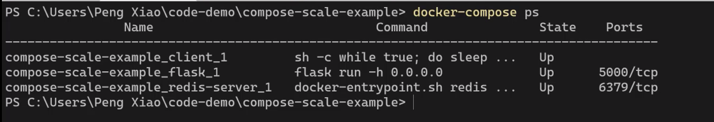
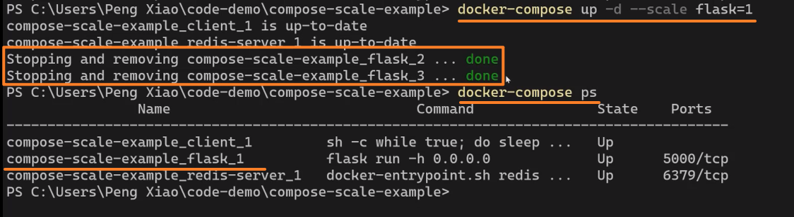
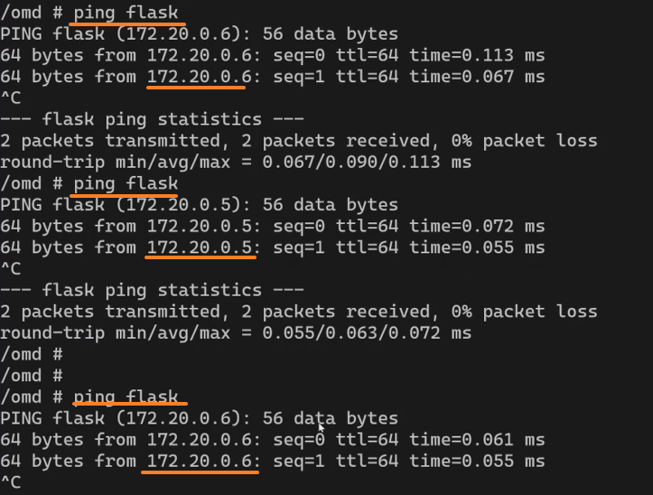
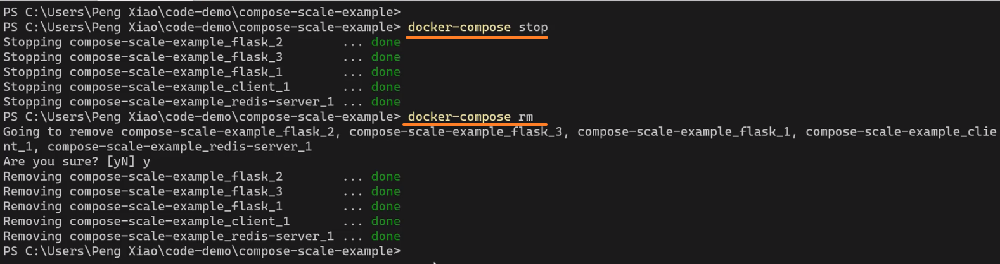
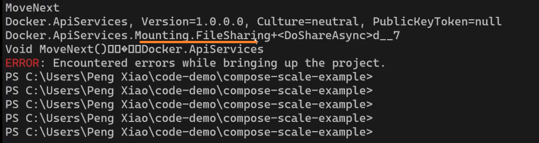
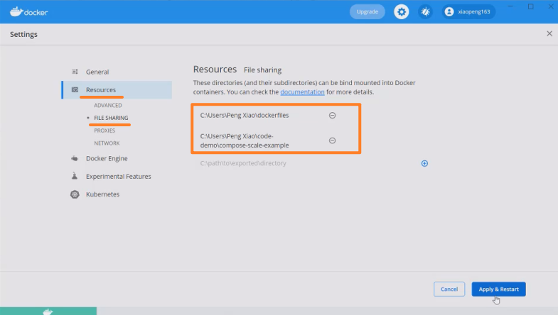
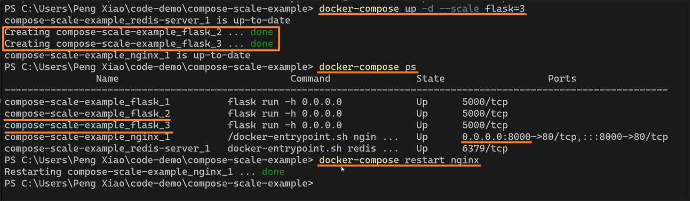

# [8-9 水平擴展和負載均衡](https://dockertips.readthedocs.io/en/latest/docker-compose/compose-scale.html)

2024年11月7日
下午 09:32

## Contents [[↑](#8-9-水平擴展和負載均衡)]

- [8-9 水平擴展和負載均衡](#8-9-水平擴展和負載均衡)
  - [Contents \[↑\]](#contents-)
    - [環境搭建 \[↑\]](#環境搭建-)
    - [水平擴展 \[↑\]](#水平擴展-)
      - [`--scale` 的負載均衡 \[↑\]](#--scale-的負載均衡-)
      - [環境清理 \[↑\]](#環境清理-)
    - [添加 nginx 與水平擴展 \[↑\]](#添加-nginx-與水平擴展-)
      - [效果 \[↑\]](#效果-)

### 環境搭建 [[↑](#8-9-水平擴展和負載均衡)]

- `docker-compose.yml`

  <table>
    <colgroup>
      <col style="width: 100%" />
    </colgroup>
    <thead>
      <tr class="header">
        <th>
          

        </th>
      </tr>
    </thead>
    <tbody>
      <tr class="odd">
        <td>
          

        </td>
      </tr>
    </tbody>
  </table>

- 啟動
  - `$ docker-compose pull`
  - `$ docker-compose build`
  - `$ docker-compose up -d`
  - `$ docker-compose ps`

    <table>
      <colgroup>
        <col style="width: 100%" />
      </colgroup>
      <thead>
        <tr class="header">
          <th>
            

          </th>
        </tr>
      </thead>
      <tbody>
      </tbody>
    </table>

- 網路通信

  <table>
    <colgroup>
      <col style="width: 100%" />
    </colgroup>
    <thead>
      <tr class="header">
        <th>
          

        </th>
      </tr>
    </thead>
    <tbody>
      <tr class="odd">
        <td>
          

        </td>
      </tr>
    </tbody>
  </table>

### 水平擴展 [[↑](#8-9-水平擴展和負載均衡)]

- 向上 scale, `$ docker-compose up -d` **`--scale flask=3`**

  <table>
    <colgroup>
      <col style="width: 100%" />
    </colgroup>
    <thead>
      <tr class="header">
        <th>
          

        </th>
      </tr>
    </thead>
    <tbody>
    </tbody>
  </table>

- 向下 scale, `$ docker-compose up -d` **`--scale flask=1`**

  <table>
    <colgroup>
      <col style="width: 100%" />
    </colgroup>
    <thead>
      <tr class="header">
        <th>
          

        </th>
      </tr>
    </thead>
    <tbody>
    </tbody>
  </table>

#### `--scale` 的負載均衡 [[↑](#8-9-水平擴展和負載均衡)]

- 準備

  <table>
    <colgroup>
      <col style="width: 100%" />
    </colgroup>
    <thead>
      <tr class="header">
        <th>
          

        </th>
      </tr>
    </thead>
    <tbody>
    </tbody>
  </table>

- `ping`

  <table>
    <colgroup>
      <col style="width: 100%" />
    </colgroup>
    <thead>
      <tr class="header">
        <th>
          

        </th>
      </tr>
    </thead>
    <tbody>
    </tbody>
  </table>

- `curl`

  <table>
    <colgroup>
      <col style="width: 100%" />
    </colgroup>
    <thead>
      <tr class="header">
        <th>
          

        </th>
      </tr>
    </thead>
    <tbody>
    </tbody>
  </table>

#### 環境清理 [[↑](#8-9-水平擴展和負載均衡)]

- `$ docker-compose stop`
- `$ docker-compose rm`

  <table>
    <colgroup>
      <col style="width: 100%" />
    </colgroup>
    <thead>
      <tr class="header">
        <th>
          

        </th>
      </tr>
    </thead>
    <tbody>
    </tbody>
  </table>

### 添加 nginx 與水平擴展 [[↑](#8-9-水平擴展和負載均衡)]

- [代碼下載](https://dockertips.readthedocs.io/en/latest/docker-compose/compose-scale.html#nginx)

  <table>
    <colgroup>
      <col style="width: 100%" />
    </colgroup>
    <thead>
      <tr class="header">
        <th>
          

          <ul class="incremental">
            <li>
              
將 proxy 指向 flask:5000

            </li>
            <li>
              
如果有多個 flask 服務實例, docker 會幫我們做負載均衡

            </li>
          </ul>
        </th>
      </tr>
    </thead>
    <tbody>
      <tr class="odd">
        <td>
          

          <ul class="incremental">
            <li>
              
depends_on 定義服務請動順序

            </li>
            <li>
              
bind mount

              <ul class="incremental">
                <li>
                  
用 bind mount 將 conf 文件複製進 container

                </li>
                <li>
                  
用 bind mount 將 container 的 log 映射到本地

                </li>
              </ul>
            </li>
            <li>
              
Network

              <ul class="incremental">
                <li>
                  
Backend for flask and redis-sever

                </li>
                <li>
                  
Frontend for flask and nginx

                </li>
              </ul>
            </li>
          </ul>
        </td>
      </tr>
    </tbody>
  </table>

- `$ docker-compose up -d`

  <table>
    <colgroup>
      <col style="width: 100%" />
    </colgroup>
    <thead>
      <tr class="header">
        <th>
          

        </th>
      </tr>
    </thead>
    <tbody>
      <tr class="odd">
        <td>
          

        </td>
      </tr>
      <tr class="even">
        <td>
          

        </td>
      </tr>
      <tr class="odd">
        <td>
          

        </td>
      </tr>
    </tbody>
  </table>

#### 效果 [[↑](#8-9-水平擴展和負載均衡)]

- 單一 container

  <table>
    <colgroup>
      <col style="width: 100%" />
    </colgroup>
    <thead>
      <tr class="header">
        <th>
          

        </th>
      </tr>
    </thead>
    <tbody>
      <tr class="odd">
        <td>
          

        </td>
      </tr>
    </tbody>
  </table>

- -`-scale` to 3

  <table>
    <colgroup>
      <col style="width: 100%" />
    </colgroup>
    <thead>
      <tr class="header">
        <th>
          

          <ul class="incremental">
            <li>
              
需要從新啟動 nginx

            </li>
          </ul>
        </th>
      </tr>
    </thead>
    <tbody>
      <tr class="odd">
        <td>
          

        </td>
      </tr>
      <tr class="even">
        <td>
          

        </td>
      </tr>
      <tr class="odd">
        <td>
          

        </td>
      </tr>
    </tbody>
  </table>
